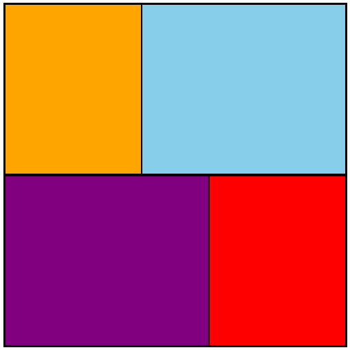
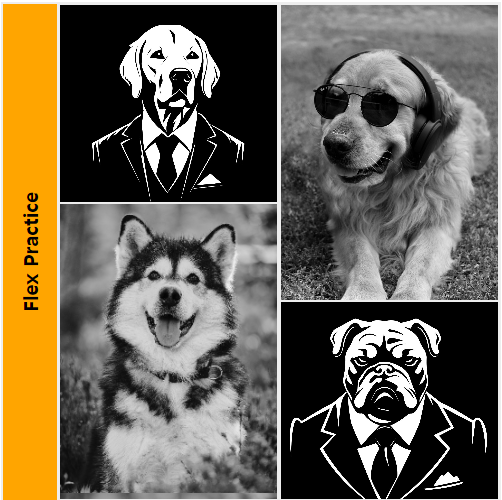
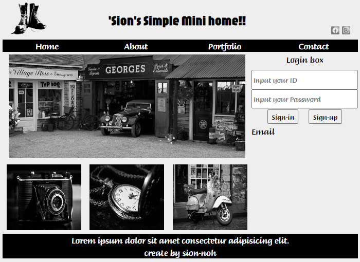

## HTML/CSS Basic Study

### HTML
Hyper Text Markup Language

- Head
  - 화면에 나타나는 것이 아닌 설정, 정보 등이 열거
- Body
  - 실제 눈에 보이는 것
- Tag
  - Tag는 속성(Attribute/Property)을 가질 수 있다.

### CSS
- 선택자
  - *{} : All Selector (모든 Element)
  - div{} : Tag Selector (모든 div Tag)
  - .box{} : Class Selector (class가 box인 Element)
  - #box{} : ID Selector (id가 box인 Element)
  - #box div {} : 후손 선택자 (id 가 box인 하위 div 후손들 태그 모두 적용)
  - #box > div {} : 자손 선택자 (id가 box인 바로 하위 div 태그만 적용)

### Layout 기법
1. Table
2. Position
3. div + float // span + inline-block
4. display : flex
5. display : grid

### display: flex
- 정렬을 기본적으로 row로 정렬
- 영역 중앙 정렬
  - display : flex;
  - justify-content : center;
    - 주축 방향 정렬
  - align-items : center;
    - 교차축 방향 정렬

## flex를 사용한 예제
 ### quiz01

### quiz02
 

### quiz03
 